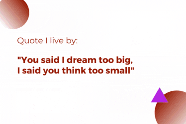

### Hello! 💫 👩🏼‍💻

###  I'm [Elif](https://www.linkedin.com/in/eliferdal/) and welcome to my GitHub profile! :octocat:

  
 

**Fun facts:**

👩‍🎓 Mechatronics Engineer with a passion for machine learning engineering and cloud science. 
  
🌞 My goal is to leverage my skills to solve real-world problems and contribute to the tech community. 
  
🍒 Feel free to explore my repositories to learn more about my journey!
  
🌐💡 Obsessed with ML Engineering, MLops, and turning complex data architectures into efficient, scalable solutions. Let’s streamline those data pipelines and transform raw data into meaningful results! 

 

## Languages and Tools  

  
 

 
  
  
   
  
  
  

  
 

  

 

  
#IoT #womeninengineering  
<!--
**eliferdals/eliferdals** is a ✨ _special_ ✨ repository because its `README.md` (this file) appears on your GitHub profile.

Here are some ideas to get you started:

- 🔭 I’m currently working on ...
- 🌱 I’m currently learning ...
- 👯 I’m looking to collaborate on ...
- 🤔 I’m looking for help with ...
- 💬 Ask me about ...
- 📫 How to reach me: ...
- 😄 Pronouns: ...
- ⚡ Fun fact: ...
-->
